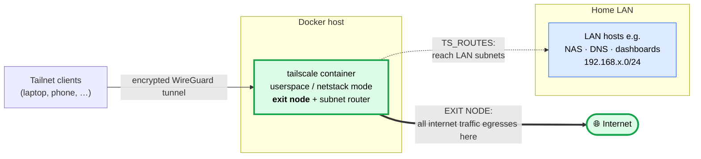

# homelab-tailscale

> A drop-in **Tailscale exit node + subnet router** for your homelab — runs as a single,
> **unprivileged** Docker container (no `--privileged`, no `NET_ADMIN`, no `/dev/net/tun`),
> configured entirely from one `.env` file.

[](LICENSE)


Route your devices' internet traffic out through your home connection from anywhere, and
reach machines on your home LAN over an encrypted [WireGuard](https://www.wireguard.com/)
mesh — without poking holes in your firewall or exposing any ports.

## Why use this

- **🌐 Exit node, the easy way.** Browse from your laptop or phone as if you were home —
  same public IP, same geo, encrypted end-to-end.
- **🏠 Reach your LAN remotely.** Advertise your home subnets (`TS_ROUTES`) to hit NAS,
  printers, dashboards, or your local DNS resolver from anywhere on the tailnet.
- **🔒 Unprivileged by default.** Userspace (netstack) networking means **no elevated
  capabilities and no host TUN device** — a smaller blast radius than typical Tailscale
  container guides. `no-new-privileges` is on. Flip a single flag if you want kernel-mode
  throughput instead.
- **🧩 One-file config.** Everything lives in `.env`; the compose file is fully
  parameterized and heavily commented.
- **🛠️ Zero-friction ops.** A thin `compose-helper.sh` wrapper gives you `up`, `restart`,
  `logs`, and friends without remembering `docker compose` incantations.
- **♻️ Survives restarts.** Node identity persists in a named volume — no re-auth churn.

## How the networking works

The **primary job is exit node**: tailnet clients route their internet traffic through
this container so it egresses from your home network's public IP. Secondarily, `TS_ROUTES`
makes it a **subnet router** so clients can reach hosts on your home LAN (e.g. a local DNS
resolver).



- **Thick green path = the main use:** internet egress via the exit node
  (`--advertise-exit-node` in `TS_EXTRA_ARGS`).
- **Dashed blue path = `TS_ROUTES`:** optional subnet routing to LAN hosts; leave it empty
  to run exit-node-only. Both the exit node and each route must be **approved in the admin
  console** before clients can use them.

## Quick start

> Requires Docker + the Compose plugin, and a [Tailscale](https://tailscale.com/) account.

```bash
git clone https://github.com/jpbaking/homelab-tailscale.git
cd homelab-tailscale

cp .env.example .env        # then edit: set TS_AUTHKEY and your TS_ROUTES
./compose-helper.sh up      # build/pull, start detached, follow logs
```

Then, in the [admin console](https://login.tailscale.com/admin/machines), **approve the
advertised subnet routes and the exit node** for this machine — they stay off until approved.

1. **Get an auth key** at <https://login.tailscale.com/admin/settings/keys>. A *reusable +
   pre-approved + tagged* key is recommended for unattended containers.
2. **Configure** by copying `.env.example` to `.env` (gitignored) and filling it in — see
   [`.env.example`](.env.example) for every variable and what it does.
3. **Run** with `./compose-helper.sh up`.
4. **Approve** the node's routes/exit-node in the admin console.

## Configuration (`.env`)

This image is configured through environment variables — a TLDR of the
[official Tailscale Docker docs](https://tailscale.com/docs/features/containers/docker/how-to/connect-docker-container):

| Variable | What it does |
|---|---|
| `TS_AUTHKEY` | Auth key that logs the node into your tailnet. **Required.** |
| `TS_HOSTNAME` | Name the node shows up as in the tailnet. |
| `TS_STATE_DIR` | Where tailscaled persists login/state inside the container (backed by a named volume so it stays logged in across restarts). |
| `TS_USERSPACE` | `true` = userspace/netstack networking (no TUN/`NET_ADMIN`); `false` = kernel networking (needs the TUN device + `NET_ADMIN`, higher throughput). |
| `TS_ROUTES` | Comma-separated CIDRs to advertise as a **subnet router**. Empty = exit-node-only. |
| `TS_ACCEPT_DNS` | Whether this node accepts DNS config pushed by the tailnet. |
| `TS_EXTRA_ARGS` | Any extra `tailscale up` flags, e.g. `--advertise-exit-node`. |
| `TS_IMAGE_TAG` | `tailscale/tailscale` image tag to run. |

## Files

| File | Purpose |
|---|---|
| `docker-compose.yaml` | The Tailscale service definition (single service, fully commented). |
| `.env.example` | Template for `.env`. Copy it; `.env` itself is gitignored (holds the auth key). |
| `compose-helper.env` | Config for the helper script (project name, timeouts, log tail). |
| `compose-helper.sh` | Wrapper around `docker compose` with consistent project naming and shorthand commands. |

## Helper commands

```bash
./compose-helper.sh up        # rebuild/pull, start detached, then follow logs
./compose-helper.sh start     # start detached (no pull/build)
./compose-helper.sh restart   # down then up
./compose-helper.sh stop      # stop + remove orphans
./compose-helper.sh down      # stop + remove orphans AND named volumes (wipes state!)
./compose-helper.sh logs      # follow logs
```

Anything else passes straight through to `docker compose`, e.g.
`./compose-helper.sh ps` or `./compose-helper.sh exec tailscale tailscale status`.

> ⚠️ `down` removes the `tailscale` named volume, which holds node state. After that the
> container re-authenticates with `TS_AUTHKEY` on next start. Use `stop`/`restart` for
> routine operations.

## Notes & gotchas

- **State** lives in the `tailscale` named volume at `/var/lib/tailscale`. Don't `down -v`
  unless a clean re-auth is intended.
- **Networking is deliberate.** This runs in userspace/netstack mode (`TS_USERSPACE=true`),
  so the `/dev/net/tun` device, `cap_add: NET_ADMIN`, and forwarding sysctls are
  intentionally commented out — netstack forwards subnet-router and exit-node traffic in
  userspace without them. The cost is throughput, not capability. To switch to kernel
  networking for line-rate forwarding, set `TS_USERSPACE=false` and uncomment the
  `devices`, `cap_add`, and `sysctls` blocks in `docker-compose.yaml` (drop the ipv6
  forwarding sysctl if the host has IPv6 disabled). `NET_RAW` is never needed.
- **Split DNS for LAN hostnames** (resolve `*.lan` etc. through a home resolver) is set up
  in the Tailscale admin console (DNS → restricted nameserver), not in this repo. It rides
  on an advertised+approved subnet route to that resolver's IP.
- **Linux clients** must run `tailscale up --accept-routes` to use advertised subnets; GUI
  clients accept them by default.
- `compose-helper.sh` is intended for local/homelab use — `down` deletes volumes and `.env`
  is sourced into the process. Review before using it in CI.
- Changing advertised routes or exit-node status requires **re-approval** in the admin console.

## License

[0BSD](LICENSE) — do whatever you want with it, no attribution required.

## Acknowledgements

Built on [Tailscale](https://tailscale.com/)'s official
[`tailscale/tailscale`](https://hub.docker.com/r/tailscale/tailscale) image. See their
[Docker how-to](https://tailscale.com/docs/features/containers/docker/how-to/connect-docker-container)
and [example configs](https://github.com/tailscale-dev/docker-guide-code-examples) for more.
